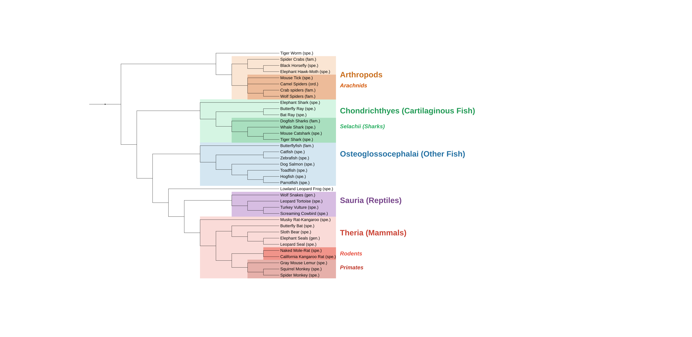

# tree-of-similar-life

Code / data files for creating a "similar-but-different" tree of life.

Created using:

* http://phylot.biobyte.de/
* http://itol.embl.de/
* https://www.ncbi.nlm.nih.gov/Taxonomy/Browser/wwwtax.cgi
